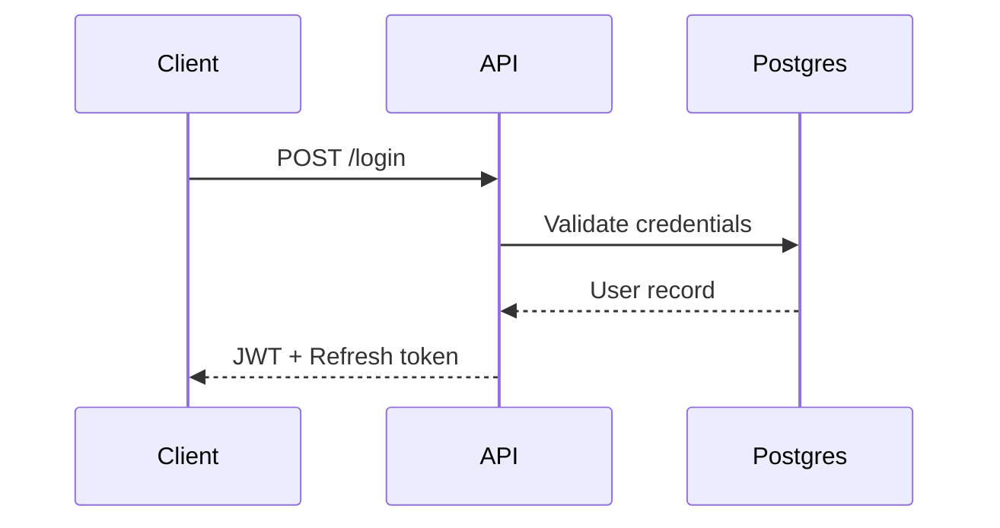

Blog 13) Title- When App Security Meets AI: The Economics of Easy Exploits
Subtitle- How generative models turned reverse engineering, realistic bots, and prompt-injection into mass-market threats
Link- https://aneesas.hashnode.dev/when-app-security-meets-ai-the-economics-of-easy-exploits
Before AI, attacking a mobile app was hard work.  
  
You needed someone who could read 𝗔𝗥𝗠 𝗮𝘀𝘀𝗲𝗺𝗯𝗹𝘆, set up 𝗙𝗿𝗶𝗱𝗮, 𝗠𝗜𝗧𝗠 your traffic, and actually understand what they were looking at. That person was expensive. Most apps were safe because they just weren't worth the effort.  
  
Now? Someone types "decompile this APK and explain the auth flow" into an AI and gets a readable walkthrough in 30 seconds.  
  
That clever 𝗼𝗯𝗳𝘂𝘀𝗰𝗮𝘁𝗶𝗼𝗻 you shipped? AI sees right through it.  
That custom 𝗔𝗣𝗜 𝘀𝗶𝗴𝗻𝗶𝗻𝗴 scheme you built? AI writes a working client in a minute.  
That 𝗖𝗔𝗣𝗧𝗖𝗛𝗔 protecting your signup? Solved.  
  
The whole economic equation of "𝗺𝗮𝗸𝗲 𝗮𝘁𝘁𝗮𝗰𝗸𝗶𝗻𝗴 𝗲𝘅𝗽𝗲𝗻𝘀𝗶𝘃𝗲" just collapsed.  
  
Here's what actually changed in the threat model:  
  
→ 𝗥𝗲𝘃𝗲𝗿𝘀𝗲 𝗲𝗻𝗴𝗶𝗻𝗲𝗲𝗿𝗶𝗻𝗴 went from specialist skill to commodity  
→ 𝗦𝗰𝗿𝗮𝗽𝗶𝗻𝗴 moved from "brittle scripts" to "agents that use your app like a human"  
→ 𝗙𝗮𝗸𝗲 𝗮𝗰𝗰𝗼𝘂𝗻𝘁𝘀 are now created by bots that hold the phone realistically, type with human cadence, even mimic hesitation  
→ 𝗣𝗵𝗶𝘀𝗵𝗶𝗻𝗴 got personalized. 𝗩𝗼𝗶𝗰𝗲 𝗰𝗹𝗼𝗻𝗶𝗻𝗴. 𝗗𝗲𝗲𝗽𝗳𝗮𝗸𝗲 𝘃𝗶𝗱𝗲𝗼 𝗰𝗮𝗹𝗹𝘀. The whole catalog.  
  
And then 𝗠𝗖𝗣 𝗮𝗻𝗱 𝗮𝗴𝗲𝗻𝘁𝘀 arrived, bringing entirely new threats:  
  
→ 𝗣𝗿𝗼𝗺𝗽𝘁 𝗶𝗻𝗷𝗲𝗰𝘁𝗶𝗼𝗻 through user content  
→ AI agents taking actions on behalf of users (sometimes the wrong ones)  
→ Sensitive data flowing into 𝗟𝗟𝗠𝘀 and showing up in places you didn't expect  
  
So what actually works now?  
  
𝗛𝗮𝗿𝗱𝘄𝗮𝗿𝗲-𝗯𝗮𝗰𝗸𝗲𝗱 𝗮𝘁𝘁𝗲𝘀𝘁𝗮𝘁𝗶𝗼𝗻. 𝗔𝗽𝗽 𝗔𝘁𝘁𝗲𝘀𝘁 on iOS. 𝗣𝗹𝗮𝘆 𝗜𝗻𝘁𝗲𝗴𝗿𝗶𝘁𝘆 on Android.  
  
These are cryptographic proofs that requests are coming from YOUR real app on a real device. AI can't fake them because the keys live in the 𝘀𝗲𝗰𝘂𝗿𝗲 𝗲𝗻𝗰𝗹𝗮𝘃𝗲.  
  
If your API can be called without one of these? Assume it will be.  
  
Other things that still matter:  
  
→ 𝗦𝗲𝗿𝘃𝗲𝗿-𝘀𝗶𝗱𝗲 is your ONLY real security boundary now (it always was, but now it really is)  
→ 𝗣𝗮𝘀𝘀𝗸𝗲𝘆𝘀 instead of passwords  
→ 𝗕𝗲𝗵𝗮𝘃𝗶𝗼𝗿𝗮𝗹 𝗯𝗶𝗼𝗺𝗲𝘁𝗿𝗶𝗰𝘀 (how someone holds the phone is still hard to fake)  
→ Treat every 𝗟𝗟𝗠 output as untrusted input  
→ Minimize what you collect (data you don't have can't leak)  
  
The honest take?  
  
You can't make your app unhackable. That was never the goal.  
  
What you CAN do is make sure that when attackers succeed at the client layer — and they will — they hit a wall at the server boundary.  
  
The fundamentals didn't change. 𝗧𝗟𝗦, 𝘀𝗲𝗰𝘂𝗿𝗲 𝘀𝘁𝗼𝗿𝗮𝗴𝗲, 𝗹𝗲𝗮𝘀𝘁 𝗽𝗿𝗶𝘃𝗶𝗹𝗲𝗴𝗲, 𝗱𝗲𝗳𝗲𝗻𝘀𝗲 𝗶𝗻 𝗱𝗲𝗽𝘁𝗵 — all still essential.  
  
What changed is the cost of getting it wrong.  
  
AI didn't make mobile security harder.  
It just removed the option of being lazy about it.  
  
Curious — has your team added 𝗔𝗽𝗽 𝗔𝘁𝘁𝗲𝘀𝘁 or 𝗣𝗹𝗮𝘆 𝗜𝗻𝘁𝗲𝗴𝗿𝗶𝘁𝘆 yet? Or still running on hope and rate limits?

Blog 14) Title- .md Files Became the Bridge Between Human Intent and AI Execution
Subtitle- Token efficiency, AI context, PRD myths, and the practical developer workflow nobody is fully explaining
Link- https://aneesas.hashnode.dev/md-files-became-the-bridge-between-human-intent-and-ai-execution
I kept seeing statements like:

> "Markdown is the New API" "The Death of the PRD" ".md files are the hottest thing in tech right now"

So I decided to actually understand what's going on — and here's my honest breakdown as a software developer.

## First, What Actually Changed?

Markdown files have existed since 2004. They're plain text files with minimal formatting syntax — headings, lists, tables, code blocks. Nothing revolutionary on their own.

What changed is AI tools.

Every major AI coding tool — Claude Code, Cursor, GitHub Copilot, Windsurf — reads `.md` files natively. They understand structure in a way they simply can't with PDFs or Word documents. And the token efficiency difference is significant:

| Format | Tokens (10-page doc) |
| --- | --- |
| Raw PDF | 6,000 – 8,000 |
| Full `.md` | 3,000 – 4,000 |
| Cleaned `.md` | 2,000 – 2,500 |
| Delta `.md` (changes only) | 200 – 500 |
| Frontmatter summary | 50 – 100 |

That's not hype. That's just math.

## Why Should You Start Working With `.md` Files?

### 1\. Persistent AI Context

Every AI coding tool auto-reads a config `.md` file at the start of every session:

| Tool | File |
| --- | --- |
| Claude Code | `CLAUDE.md` |
| Cursor | `.cursorrules` |
| GitHub Copilot | `.github/copilot-instructions.md` |
| Windsurf | `.windsurfrules` |
| Aider | `CONVENTIONS.md` |

You write your stack, conventions, and current sprint focus once. The AI never forgets it. You stop re-explaining your project from scratch every single session.

```markdown
# CLAUDE.md

## Stack
Next.js, Hono, Postgres, Drizzle, noble/ed25519

## Conventions
- Always async/await, never callbacks
- Zod schemas for all inputs
- Business logic in /services only

## Current Sprint
- [ ] Bot detection dashboard (WIP)
- [x] Opt-out ledger schema

## Never Touch
- /src/ledger/signing.ts — cryptographic core, locked
```

### 2\. Planning Before Coding — The Spec-First Workflow

Senior developers are adopting a "spec-first" approach — writing `SPEC.md` or `PLAN.md` before touching any code. You define the problem, the approach, acceptance criteria, and what's explicitly out of scope. Then you hand it to an AI coding agent and say "implement this."

The output quality difference is significant.

```markdown
# SPEC.md — Refresh Token Rotation

## Problem
Stateless JWTs can't be revoked. Need rotation with reuse detection.

## Approach
- Store refresh token families in Postgres
- On reuse detection, invalidate entire family
- Redis for fast lookup, Postgres as source of truth

## Acceptance Criteria
- [ ] Reuse triggers full family invalidation
- [ ] New token issued on every valid refresh
- [ ] Audit log entry on every rotation

## Out of Scope
- Cross-device session management (v2)
```

### 3\. Architecture Decisions That Travel With Code

Architecture Decision Records (ADRs) in `/adr/*.md` capture not just *what* was decided, but *why*. When a new developer joins, or when you ask an AI "why are we using Ed25519 over RSA here?" — the answer is right there, versioned in Git alongside the code that implements it.

```markdown
# ADR-001: Ed25519 over RSA for JWT Signing

## Status: Accepted

## Context
Need asymmetric signing for distributed token verification.

## Decision
Ed25519 via noble/ed25519 — smaller keys, faster verification.

## Consequences
+ 32-byte keys vs 256-byte RSA keys
+ Sub-millisecond signing
- Less legacy library support
```

### 4\. Token Conservation at Scale

As your project grows, naively feeding full documents to AI tools every session becomes expensive and slow. The pattern that works:

*   `prd.md` — full requirement doc, feed once
    
*   `prd-delta.md` — only what changed recently, feed every session
    
*   Frontmatter summaries — let AI decide what to load
    

```markdown
---
title: AI Content Shield PRD
version: 1.4
last_updated: 2026-06-05
summary: Three-primitive architecture — bot detection, compliance ledger, revenue routing
key_sections: [Bot Detection, Compliance Module, Revenue Routing]
---
```

A focused delta file costs 200–500 tokens. The full doc costs 3,000–4,000. Over weeks of daily sessions, that compounds significantly.

### 5\. Diagrams as Code with Mermaid

Instead of screenshot images of flowcharts that can't be versioned, Mermaid syntax inside `.md` files gives you diagrams that:

*   Diff cleanly in Git
    
*   Render in GitHub, VS Code, and Claude
    
*   Cost almost no tokens
    

````markdown

````

Same information. Fully versionable. AI-readable. No Figma or Lucidchart needed for technical diagrams.  
  


## How to Use `.md` Files Effectively

### The Folder Structure That Works

```plaintext
/your-project
├── CLAUDE.md                 ← AI reads this every session
└── /docs
    ├── prd.md                ← converted requirement doc
    ├── prd-delta.md          ← only recent changes
    ├── /adr                  ← architecture decisions
    ├── /runbooks             ← ops playbooks
    └── /prompts              ← reusable AI prompt templates
```

**Key principle:** `CLAUDE.md` should be a pointer file, not a content dump. It tells the AI where things live — it doesn't contain everything itself.

### Converting Existing Documents to `.md`

For converting PDFs, DOCX, and PPTX to `.md`:

**MarkItDown** (Microsoft — 143k GitHub stars) — widest format support, CLI + Python API:

```bash
pip install 'markitdown[all]'
markitdown requirements.pdf -o requirements.md
```

**Pandoc** — gold standard for text-based document conversion:

```bash
pandoc requirements.docx -o requirements.md
```

**Docling** (IBM) — best for complex PDFs with tables and layouts.

### Converting `.md` Back to Human-Readable Formats

```bash
pandoc docs/prd.md -o docs/prd-export.docx   # Word
pandoc docs/prd.md -o docs/prd-export.pdf    # PDF
marp slides.md -o slides.pptx                # Slides
```

Both Pandoc and Marp support branded reference templates so output looks professional.

## The Image Problem — The Blind Spot Nobody Talks About

This is the most important caveat in this entire post.

Traditional PRDs are heavily visual. They contain:

*   UI wireframes and mockups
    
*   User flow diagrams
    
*   Architecture overviews
    
*   Entity Relationship Diagrams (ERDs)
    
*   Sequence diagrams
    
*   Annotated screenshots
    

When you blindly convert a PRD to `.md`, those images are **silently dropped**. A wireframe that defines what gets built. An architecture diagram that defines system boundaries. A user flow that defines every decision branch. All gone — unless you deliberately handle them.

The fix:

| Image Type | Best Handling |
| --- | --- |
| UI wireframes / mockups | Extract + LLM Vision description OR Figma link |
| User flow diagrams | Redraw as Mermaid flowchart |
| Architecture diagrams | Redraw as Mermaid or C4 diagram |
| ERDs | Redraw as Mermaid `erDiagram` |
| Sequence diagrams | Redraw as Mermaid `sequenceDiagram` |
| Metric charts | Convert to markdown table |
| Stock photos | Drop safely |

Never treat a single auto-converted `prd.md` as complete if the original had architectural or flow diagrams in it.

## What `.md` Files Do Not Replace

This is where I push back on the hype — and I think it matters.

`.md` **files are powerful for:**

*   Preserving project context across AI sessions
    
*   Defining conventions and architecture decisions
    
*   Technical documentation that lives with code in Git
    
*   Feeding requirement context to AI coding agents efficiently
    
*   Runbooks, playbooks, and ops documentation
    
*   Reusable prompt templates for your team
    

`.md` **files are not suited for:**

*   Multi-audience stakeholder communication
    
*   Visual design specifications and mockups
    
*   Complex formatted reports for non-technical audiences
    
*   Documents requiring tracked changes and comments
    
*   Anything where visual fidelity matters more than machine readability
    

A traditional PRD serves multiple audiences simultaneously — engineers, designers, PMs, QA, and business stakeholders. A `.md` file optimized for AI context doesn't serve that communication need.

## The Split, Not the Replacement

What's actually happening isn't replacement. It's a split:

```plaintext
Requirement PDF/DOCX
        ↓
   Two derivatives
    ↙         ↘
PDF/DOCX      .md file
for humans    for AI + devs
```

The `.md` version is a derivative of the PRD, optimized for a different consumer. Both coexist. The PRD isn't dying — it's evolving into two artifacts with two different jobs.

## The Developer `.md` Infrastructure

Once you build this out, your workflow looks like:

```plaintext
/your-project
├── CLAUDE.md          → AI context, auto-read every session
├── SPEC.md            → planning before code
└── /docs
    ├── /adr           → why decisions were made
    ├── /runbooks      → ops playbooks
    ├── /research      → converted papers and articles
    └── /prompts       → reusable AI prompt templates
```

The habit shift: **anything you'd put in a Notion page, Confluence doc, or Jira comment — put in a** `.md` **file in the repo instead.** It travels with the code, versions with Git, and every AI tool can read it without copy-pasting.

## The Bottom Line

Markdown isn't the death of the PRD. It isn't the new API for humans. It isn't replacing documents.

It is the most efficient bridge we currently have between human intent and AI execution.

For a software developer working with AI tools daily — building that `.md` infrastructure around your project is one of the highest-leverage things you can do right now. Not because of hype. Because of the math.

Write once. Every AI tool reads it. Every session starts with full context. Token costs stay flat as your project grows.

That's the actual story.  
  
#SoftwareDevelopment #AI #Markdown #DeveloperTools #Vibecoding #ClaudeCode **#FutureOfWork** **#TechTrends2026** **#AIProductivity** **#AIForDevelopers** **#TokenEfficiency** **#TechStrategy** **#MarkdownFiles**

Blog 15) Title- Building mobile apps with AI in 2026: lessons from Rork, Vibecode, and Draftbit
Subtitle- Actionable takeaways for founders and engineers evaluating AI-assisted app builders today.
Link- https://aneesas.hashnode.dev/building-mobile-apps-with-ai-in-2026-lessons-from-rork-vibecode-and-draftbit
This week I tried 3 𝗔𝗜 𝗮𝗽𝗽 𝗯𝘂𝗶𝗹𝗱𝗲𝗿𝘀 𝗳𝗼𝗿 𝗺𝗼𝗯𝗶𝗹𝗲: 𝗥𝗼𝗿𝗸, 𝗩𝗶𝗯𝗲𝗰𝗼𝗱𝗲, and 𝗗𝗿𝗮𝗳𝘁𝗯𝗶𝘁. Here's what I found 👇

1.  𝗥𝗼𝗿𝗸: [https://rork.com/](https://rork.com/)  
    Generates real native Swift code for iOS (the base tier generates React Native via Expo; the Pro tier generates native Swift). Has clean plugin options for Sign in with Apple, native notifications, and App Store deployment via EAS.  
      
    The UI output felt good- visually polished, native-feeling. But the logic layer is where it struggles. Streak calculations, state management, anything beyond surface-level CRUD needs significant manual rework before it's production-ready.  
      
    Credit-based pricing also gets expensive fast on iterative builds. Every refinement consumes credits, and a real app needs many refinements. Promising direction, not yet a tool I'd ship from.
    
2.  𝗩𝗶𝗯𝗲𝗰𝗼𝗱𝗲: [https://www.vibecodeapp.com/workspace](https://www.vibecodeapp.com/workspace)  
    Generates React Native via Expo for both iOS and Android. The interesting differentiator: you can plug in different AI models (Claude, GPT, Gemini, ElevenLabs). It also has a prompt pool you can reference.  
      
    Community is still very new. Worth watching, but not the one I'd start a serious build on today.
    
3.  𝗗𝗿𝗮𝗳𝘁𝗯𝗶𝘁: [https://draftbit.com/](https://draftbit.com/)  
    A drag-and-drop visual builder that generates clean, exportable React Native code, now augmented with AI for prompt-based assist.  
    Can preview the app on your own phone via the Draftbit preview app. Plug in MCP servers, REST APIs, or GraphQL endpoints, including custom ones. Choose which AI model assists you (Claude, Codex, etc.).  
      
    Theme management and Git history tracking are genuinely clean.  
    If you're a designer or design-conscious builder who wants visual control plus exportable code, its a good option. If you want a pure "describe it and ship it" experience, it's not that.
    

Which of these have you tried? What got built well and what fell flat?

#MobileDevelopment #AIAgents #VibeCoding #ReactNative #iOSDevelopment #AndroidDevelopment #Rork #Vibecode #Draftbit #AppDevelopment #AICoding #AIAppBuilders

Blog 16) Title- Expose Your App's Actions — or Lose Them to Siri's AI
Subtitle- A developer‑focused analysis of WWDC 2026, App Intents, and the roadmap for migrating from SiriKit.
Link- https://aneesas.hashnode.dev/expose-your-app-s-actions-or-lose-them-to-siri-s-ai
Siri finally got its AI brain at WWDC 2026. The keynote framed it as a consumer story — a conversational assistant that reads the screen and acts across apps. But the part that actually changes my week as a developer is quieter: the framework that feeds that assistant has been shipping since 2022, and Apple just made it the only way in.

If you build for Apple platforms — or bridge to them from Flutter or React Native, like a lot of us do — this post is the developer cut of what landed and what's worth doing about it now.

## The keynote story vs. the developer story

The new Siri runs on a Gemini layer. It can hold a back-and-forth conversation, has on-screen awareness, and can take actions inside and across apps. That's the headline.

Here's the catch nobody puts on a slide: an assistant that *acts* can't rely on screenshots and simulated taps. To do something useful with your app, it needs to know what your app can *do* — the verbs and nouns inside it, described in a structured way it can reason over. That description is **App Intents**. And this year Apple deprecated **SiriKit**, giving a multi-year migration window but making intents the only supported path into the new Siri.

So the developer translation of "Siri got smart" is: *your app's actions are now an API surface for an assistant, and App Intents is how you publish it.*

## A quick history: how App Intents got here

This matters because the "why now" only lands if you see the arc.

*   **2016 — SiriKit (iOS 10).** XML intent definition files, a separate Intents extension process, results passed back over an IPC layer you didn't control. Verbose, fragile, and locked to a handful of Apple-defined domains.
    
*   **2022 — App Intents (iOS 16).** Pure Swift. The compiler reads your intent definitions at build time and generates compact metadata that lives in the app bundle, so the OS knows what your app can do *without launching it*. No extension, no IPC.
    
*   **2024 — Apple Intelligence hooks (iOS 18).** App Intents wired into personal context and on-screen awareness; Spotlight could run actions directly.
    
*   **2026 — SiriKit deprecated.** App Intents becomes the required on-ramp to the Gemini-powered Siri.
    

Apple spent four years quietly laying this track. WWDC 2026 was largely flipping the switch.

## Making your app callable: App Intents in practice

The core unit is an `AppIntent`: a single action with typed parameters and a `perform()` body.

```swift
import AppIntents

struct CreateTaskIntent: AppIntent {
    static let title: LocalizedStringResource = "Create Task"
    static let description = IntentDescription("Creates a new task in MyApp.")

    @Parameter(title: "Task Name")
    var name: String

    @Parameter(title: "Due Date")
    var dueDate: Date?

    // Keep it headless when the action doesn't need UI.
    static var openAppWhenRun: Bool = false

    func perform() async throws -> some IntentResult & ProvidesDialog {
        let task = try await TaskStore.shared.create(name: name, due: dueDate)
        return .result(dialog: "Added \(task.name) to your list.")
    }
}
```

To make Siri discover it without the user hand-building a Shortcut, expose it through an `AppShortcutsProvider` with natural-language phrases:

```swift
struct MyAppShortcuts: AppShortcutsProvider {
    static var appShortcuts: [AppShortcut] {
        AppShortcut(
            intent: CreateTaskIntent(),
            phrases: [
                "Add a task in \(.applicationName)",
                "Create a \(.applicationName) task"
            ],
            shortTitle: "Create Task",
            systemImageName: "checkmark.circle"
        )
    }
}
```

When your actions operate on domain objects, model them as `AppEntity` so Siri can refer to and resolve them:

```swift
struct TaskEntity: AppEntity {
    static var typeDisplayRepresentation: TypeDisplayRepresentation = "Task"
    static var defaultQuery = TaskQuery()

    var id: UUID
    @Property(title: "Name") var name: String

    var displayRepresentation: DisplayRepresentation {
        DisplayRepresentation(title: "\(name)")
    }
}
```

That's the whole game: define actions, type their parameters, model your entities. One integration, and those actions surface across Siri, Spotlight, Shortcuts, the Action Button, widgets, and controls.

## On-device intelligence: Foundation Models goes multimodal

The second big update is the **Foundation Models** framework — Apple's on-device LLM, roughly a 3B-parameter model, Swift-native, free, and offline. It shipped with iOS 26 for text. At WWDC 2026 it gained **image input**, plus custom skills and the option to fall back to a larger server model when a task needs it.

The text API is stable and worth knowing. Always gate on availability first:

```swift
import FoundationModels

let model = SystemLanguageModel.default
guard case .available = model.availability else {
    // Fall back to your own logic or a remote model.
    return
}

let session = LanguageModelSession()
let response = try await session.respond(to: "Summarize this note: \(noteText)")
print(response.content)
```

For structured output, `@Generable` lets the model return typed Swift values instead of strings you have to parse:

```swift
@Generable
struct ExtractedTask {
    @Guide(description: "Short task title") var title: String
    @Guide(description: "Due date if mentioned") var dueDate: String?
}

let task = try await session.respond(
    to: "Pull a task out of: \(emailBody)",
    generating: ExtractedTask.self
)
```

The new multimodal path lets you pass an image alongside the prompt — think "summarize this receipt" or "describe this photo for accessibility," running entirely on device. The exact 2026 API for attaching images is rolling out with the iOS 27 SDK, so confirm the final signature against Apple's documentation before you build against it. The capability is the point: you can ship intelligent, private features without a server bill or a network round trip.

## Privacy by declaration: per-intent cloud controls

App Intents also picked up per-intent cloud controls. Conceptually, you can now declare whether a given interaction is allowed to leave the device at all. On-device requests stay local; complex queries route to Apple's confidential-compute servers, which — per Apple — don't use your Siri data for model training.

For finance, health, and enterprise apps, that's the missing piece: a clean way to say "this action is device-only, full stop" while still participating in the assistant layer. (As with multimodal, treat the precise declaration API as new — verify it against the iOS 27 docs before relying on it.)

## Tooling and reach: Xcode 27 and iOS 27

Two pragmatic notes from the same release. **Xcode 27** added on-device AI code completion, so a chunk of the autocomplete you've been pasting from a chat window now happens locally in the editor. And **iOS 27 runs back to the iPhone 11** — the widest device support of any release — which lowers the minimum-deployment-target math for adopting the new APIs, even if the heaviest on-device models still favor newer silicon.

## What about cross-platform? The Flutter reality

If you build in Flutter (I do), here's the honest constraint: App Intents are defined in **native Swift**. The metadata Siri reads lives in the app bundle as compiled native code, so you can't declare intents purely in Dart.

The practical path is a plugin that generates and bridges the Swift layer. `flutter_app_intents` wires App Intents (Siri, Shortcuts, Spotlight) into a Flutter app on iOS 16+, and the flow ends up looking like:

```plaintext
Siri command
  → Swift intent handler (generated)
  → MethodChannel / Pigeon
  → your Dart logic
```

So a hybrid app absolutely can plug into the new Siri's action layer — it just can't pretend the native seam isn't there. If you're on FlutterFlow specifically, this is heavier still: you need code export (Pro plan) and an Intents extension added in Xcode, because the visual builder can't configure it.

Running Apple's on-device model *inside* your Flutter UI is the less-mature story — Foundation Models is native Swift, and you'll mostly be writing your own bridge for now.

## What to actually do now

1.  **Audit your app's verbs.** List the five actions users perform most. Those are your first intents.
    
2.  **Model your core objects as** `AppEntity`**.** It's what lets Siri reference "that task" or "this playlist."
    
3.  **Start the SiriKit migration.** It's a clock, not a crisis — but the window is finite, and intents unlock everything new.
    
4.  **Prototype one Foundation Models feature.** Summarize, extract, or classify something locally. Gate on `availability` and keep a fallback.
    
5.  **Mark sensitive actions device-only** if you're in a regulated category, once the cloud-control API is confirmed.
    

## Where this is heading

The throughline across all of it: the assistant layer is real now, and the way you participate is by describing what your app can do — not by redesigning screens. App Intents is the contract; Foundation Models is the local brain. Most of this is buildable today, not a beta promise.

I'm spending this week in Apple's WWDC group labs — Apple Intelligence, Machine Learning & AI, and Privacy & Security — digging into how much of this is shippable today versus next year. I'll follow up with what actually holds up once I've built against it.

In the meantime, the question worth sitting with: which action in your app deserves to be an intent first?  
  
🔗 Apple Developer - WWDC 2026: [**https://lnkd.in/eUnzREwK**](https://lnkd.in/eUnzREwK)  
[**hashtag#WWDC2026**](https://www.linkedin.com/search/results/all/?keywords=%23wwdc2026&origin=HASH_TAG_FROM_FEED) [**hashtag#AppIntents**](https://www.linkedin.com/search/results/all/?keywords=%23appintents&origin=HASH_TAG_FROM_FEED) [**hashtag#AppleIntelligence**](https://www.linkedin.com/search/results/all/?keywords=%23appleintelligence&origin=HASH_TAG_FROM_FEED) [**hashtag#iOSDev**](https://www.linkedin.com/search/results/all/?keywords=%23iosdev&origin=HASH_TAG_FROM_FEED) [**hashtag#Siri**](https://www.linkedin.com/search/results/all/?keywords=%23siri&origin=HASH_TAG_FROM_FEED) [**hashtag#SiriKit**](https://www.linkedin.com/search/results/all/?keywords=%23sirikit&origin=HASH_TAG_FROM_FEED) [**hashtag#Gemini**](https://www.linkedin.com/search/results/all/?keywords=%23gemini&origin=HASH_TAG_FROM_FEED) [**hashtag#WWDC**](https://www.linkedin.com/search/results/all/?keywords=%23wwdc&origin=HASH_TAG_FROM_FEED)